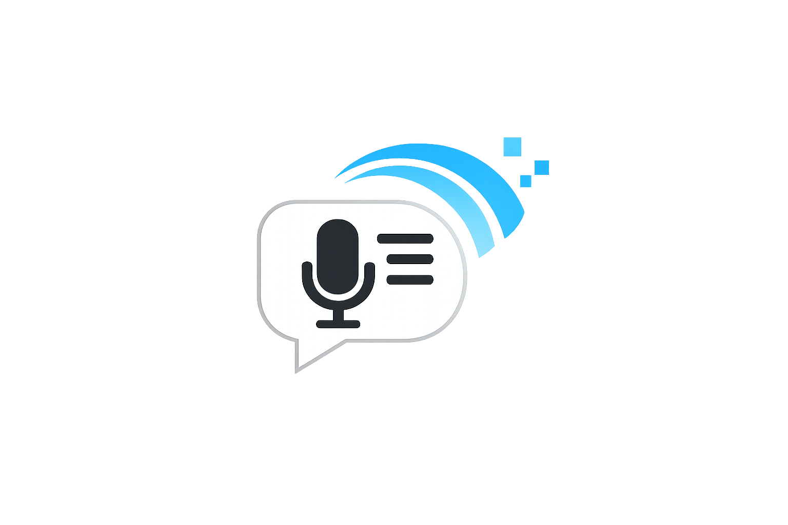

<div align="center">
  
  <h1>ConferAI</h1>
  <p><strong>Real-time AI Meeting Assistant & Conference Hall Transcription</strong></p>
</div>

ConferAI is a powerful, free, and open-source real-time transcription web application. Built specifically to bridge the gap between simple Zoom bots and expensive conference hall hardware, ConferAI provides intelligent multi-mic synchronization, native Hindi/English code-switching, and a massive HDMI presentation mode for physical audiences.

---

## ✨ Key Features

- 📡 **Magic WiFi Discovery:** Devices on the same WiFi network can click "Find on WiFi" and instantly drop into the exact same secure meeting room. No codes or links required!
- 🎙️ **True Multi-Mic Synchronization:** Everyone can join the room from their own phone or laptop. The backend merges all microphones together with hardware-level echo cancellation and aggressive noise suppression.
- 📽️ **Cinematic Presentation Mode:** Built for the stage. One click requests native HDMI fullscreen, projecting a massive, high-contrast live transcript.
- 🎨 **Smart Speaker Colors:** The AI automatically diarizes speakers and generates mathematically unique colors for each person (e.g., Speaker 1 is always blue), making it instantly obvious to an audience who is talking.
- 🇮🇳 **Native Code-Switching:** Powered by Deepgram Nova-2, the AI effortlessly understands and transcribes when speakers fluidly code-switch between English and Hindi in the exact same sentence. It also features a 500ms stutter-wait delay for perfect sentence structure.
- ☁️ **Cloud Sync & Export:** Fully integrated with Firebase Firestore to save your meeting history. Export your historical transcripts to `.docx` or `.pdf` with a single click.
- 📱 **PWA Installable:** Install it directly to your iOS or Android home screen, or as a desktop app on macOS/Windows.

---

## 🏗 Architecture

ConferAI is a modern, full-stack monorepo consisting of:

- **Frontend (`/web`)**: A Next.js 15 (App Router) React application. Uses Firebase Authentication, modern CSS Modules, and MediaDevices hardware APIs.
- **Backend (`/server`)**: A Node.js Express WebSocket server. Handles real-time binary audio streaming, deep integration with the Deepgram API, and local IP-matching for the Magic WiFi discovery feature.
- **AI/Database**: Deepgram for live transcription, Google Gemini (optional/planned) for AI summarization, and Firebase Firestore for secure cloud storage.

---

## 🚀 Getting Started

### Prerequisites
- Node.js (v18+)
- Firebase Project (Authentication & Firestore enabled)
- Deepgram API Key

### 1. Setup the Backend Server
1. Navigate to the server directory: `cd server`
2. Install dependencies: `npm install`
3. Create a `.env` file based on `.env.example`:
```env
PORT=8081
DEEPGRAM_API_KEY=your_deepgram_api_key_here
```
4. Start the server: `npm start`

### 2. Setup the Frontend Web App
1. Navigate to the web directory: `cd web`
2. Install dependencies: `npm install`
3. Create a `.env.local` file with your Firebase credentials:
```env
NEXT_PUBLIC_FIREBASE_API_KEY=your_key
NEXT_PUBLIC_FIREBASE_AUTH_DOMAIN=your_domain
NEXT_PUBLIC_FIREBASE_PROJECT_ID=your_id
NEXT_PUBLIC_FIREBASE_STORAGE_BUCKET=your_bucket
NEXT_PUBLIC_FIREBASE_MESSAGING_SENDER_ID=your_sender_id
NEXT_PUBLIC_FIREBASE_APP_ID=your_app_id
NEXT_PUBLIC_WS_URL=ws://localhost:8081
```
4. Start the development server: `npm run dev`

### 3. Setup Firebase Indexes
To ensure saved meetings load properly, deploy the Firestore indexes:
```bash
npx firebase-tools deploy --only firestore:indexes
```

---

## 💡 How to use the "Local WiFi Room"

1. Ensure your backend server is running and accessible on your local network (or deployed to a cloud provider like Render).
2. Connect your laptop and your phone to the **same WiFi network**.
3. On both devices, navigate to the Dashboard and click **Find on WiFi**.
4. The backend will automatically extract your Public IP address and instantly group both devices into the same hidden room. Press "Start Microphone" on both to test the multi-mic syncing!

---

## 📄 License
This project is open-source and available under the MIT License.